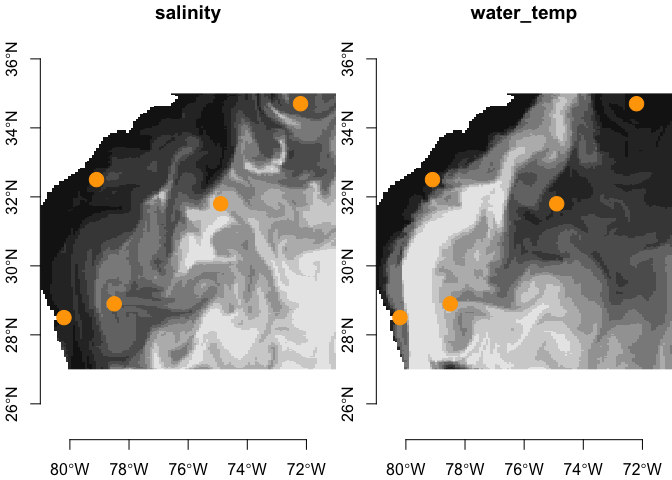

hycom
================

Provides for access from R to [HYCOM](https://www.hycom.org/) online
datasets.

### [Citation](https://www.hycom.org/)

> Bleck, R., (2001). An oceanic general circulation model framed in
> hybrid isopycnic-Cartesian coordinates. Ocean Modeling, 4: 55-88.

### Requirements

From CRAN…

- [R v4+](https://www.r-project.org/)
- [rlang](https://CRAN.R-project.org/package=rlang)
- [dplyr](https://CRAN.R-project.org/package=dplyr)
- [sf](https://CRAN.R-project.org/package=sf)
- [stars](https://CRAN.R-project.org/package=stars)

### Installation

    remotes::install_github("BigelowLab/hycom")

### Getting started

``` r
suppressPackageStartupMessages({
  library(dplyr)
  library(sf)
  library(stars)
  library(hycom)
})
```

### Working with points and bounding boxes

See the [xyzt](https://github.com/BigelowLab/xyzt) package for more
details on the example US South Atlantic Bight (SAB) data; the location
data following is adapted from that package. Here we make a bounding box
and a selection of points. We also load a coastline from
[NaturalEarth](https://www.naturalearthdata.com/) to use with plotting.

Note that the data frame, `bouys`, must be converted to a sf object,
which we call `points` to work with other sf objects. HYCOM is a 4
dimensional dataset of `lon`, `lat`, `depth` and `time` - sometimes this
is called XYZT or XYZM (M for some other dimension other than time). sf
objects handle all of the details for us, but we must inform sf of the
names of our 4 dimensions.

``` r
coast = rnaturalearth::ne_coastline(returnclass = 'sf', scale = "large")
```

    ## The legacy packages maptools, rgdal, and rgeos, underpinning this package
    ## will retire shortly. Please refer to R-spatial evolution reports on
    ## https://r-spatial.org/r/2023/05/15/evolution4.html for details.
    ## This package is now running under evolution status 0

``` r
box = sf::st_bbox( c(xmin = -81, ymin = 27, xmax = -71, ymax = 35), crs = 4326)
buoys = dplyr::tribble(
      ~id,           ~name,    ~lon,   ~lat, ~depth,               ~time,
  "41009",      "Canveral",   -80.2,   28.5,    1.5, "2022-06-17 18:05:06",
  "41010","Canaveral East",   -78.5,   28.9,    1.5, "2022-06-29 18:05:06",
  "41002","South Hatteras",   -74.9,   31.8,    1.5, "2022-06-05 18:05:06",
  "41001", "East Hatteras",   -72.2,   34.7,    2.0, "2022-04-30 18:05:06",
  "41004",        "EDISTO",   -79.1,   32.5,    1.5, "2022-07-11 18:05:06") |>
  dplyr::mutate(time = as.POSIXct(time, format = "%Y-%m-%d %H:%M:%S", tz = 'UTC'))

points = buoys |>
  sf::st_as_sf(coords = c("lon", "lat", "depth", "time"), dim = "XYZM",crs = 4326)
points
```

    ## Simple feature collection with 5 features and 2 fields
    ## Geometry type: POINT
    ## Dimension:     XYZM
    ## Bounding box:  xmin: -80.2 ymin: 28.5 xmax: -72.2 ymax: 34.7
    ## Geodetic CRS:  WGS 84
    ## # A tibble: 5 × 3
    ##   id    name                                 geometry
    ## * <chr> <chr>                             <POINT [°]>
    ## 1 41009 Canveral       ZM (-80.2 28.5 1.5 1655489106)
    ## 2 41010 Canaveral East ZM (-78.5 28.9 1.5 1656525906)
    ## 3 41002 South Hatteras ZM (-74.9 31.8 1.5 1654452306)
    ## 4 41001 East Hatteras    ZM (-72.2 34.7 2 1651341906)
    ## 5 41004 EDISTO         ZM (-79.1 32.5 1.5 1657562706)

Note that the `geometry` column contains 4 elements (XYZM) but also note
that time has reverted to the number of seconds since the time-origin of
1970-01-01T00::00:00Z.

Now we can plot these with the coast.

``` r
plot(points['name'], axes = TRUE, main = "South Atlantic Bight", 
     extent = box, reset = FALSE, key.width = lcm(8), pch = 16, cex = 2)
plot(sf::st_geometry(coast), add = TRUE, border = "black")
```

<!-- -->

### Accessing data

#### Generate a hycom url for a dataset

You have to determine which file you want to access; currently we can
access this [suite of
products](https://tds.hycom.org/thredds/catalogs/GLBy0.08/expt_93.0.html).
The `hycom_url()` function will craft the URL once you decide what file
you want to access.

``` r
url = hycom_url(filename = "ts3z",
                product = "GLBy0.08",
                version = "expt_93.0")
url
```

    ## [1] "http://tds.hycom.org/thredds/dodsC/GLBy0.08/expt_93.0/ts3z"

#### Open the resource

And then open the resource - it’s a NetCDF. Printed below is a summary
of the contents of the resource including the variables and the
dimensions over which the are defined.

``` r
X <- ncdf4::nc_open(url)
X
```

    ## File http://tds.hycom.org/thredds/dodsC/GLBy0.08/expt_93.0/ts3z (NC_FORMAT_CLASSIC):
    ## 
    ##      5 variables (excluding dimension variables):
    ##         double tau[time]   
    ##             long_name: Tau
    ##             units: hours since analysis
    ##             time_origin: 2023-09-20 12:00:00
    ##             NAVO_code: 56
    ##         short water_temp[lon,lat,depth,time]   
    ##             long_name: Water Temperature
    ##             standard_name: sea_water_temperature
    ##             units: degC
    ##             _FillValue: -30000
    ##             missing_value: -30000
    ##             scale_factor: 0.00100000004749745
    ##             add_offset: 20
    ##             NAVO_code: 15
    ##             comment: in-situ temperature
    ##         short water_temp_bottom[lon,lat,time]   
    ##             long_name: Water Temperature
    ##             standard_name: sea_water_temperature_at_bottom
    ##             units: degC
    ##             _FillValue: -30000
    ##             missing_value: -30000
    ##             scale_factor: 0.00100000004749745
    ##             add_offset: 20
    ##             NAVO_code: 15
    ##             comment: in-situ temperature
    ##         short salinity[lon,lat,depth,time]   
    ##             long_name: Salinity
    ##             standard_name: sea_water_salinity
    ##             units: psu
    ##             _FillValue: -30000
    ##             missing_value: -30000
    ##             scale_factor: 0.00100000004749745
    ##             add_offset: 20
    ##             NAVO_code: 16
    ##         short salinity_bottom[lon,lat,time]   
    ##             long_name: Salinity
    ##             standard_name: sea_water_salinity_at_bottom
    ##             units: psu
    ##             _FillValue: -30000
    ##             missing_value: -30000
    ##             scale_factor: 0.00100000004749745
    ##             add_offset: 20
    ##             NAVO_code: 16
    ## 
    ##      4 dimensions:
    ##         depth  Size:40 
    ##             long_name: Depth
    ##             standard_name: depth
    ##             units: m
    ##             positive: down
    ##             axis: Z
    ##             NAVO_code: 5
    ##         lat  Size:4251 
    ##             long_name: Latitude
    ##             standard_name: latitude
    ##             units: degrees_north
    ##             point_spacing: even
    ##             axis: Y
    ##             NAVO_code: 1
    ##         lon  Size:4500 
    ##             long_name: Longitude
    ##             standard_name: longitude
    ##             units: degrees_east
    ##             modulo: 360 degrees
    ##             axis: X
    ##             NAVO_code: 2
    ##         time  Size:14009 
    ##             long_name: Valid Time
    ##             units: hours since 2000-01-01 00:00:00
    ##             time_origin: 2000-01-01 00:00:00
    ##             calendar: gregorian
    ##             axis: T
    ##             NAVO_code: 13
    ## 
    ##     9 global attributes:
    ##         classification_level: UNCLASSIFIED
    ##         distribution_statement: Approved for public release. Distribution unlimited.
    ##         downgrade_date: not applicable
    ##         classification_authority: not applicable
    ##         institution: Fleet Numerical Meteorology and Oceanography Center
    ##         source: HYCOM archive file
    ##         history: archv2ncdf3z
    ##         field_type: instantaneous
    ##         Conventions: CF-1.6 NAVO_netcdf_v1.1

#### An important point

Data provided by HYCOM are mapped to range of longitude \[0, 360\], but
most oceanography work is done in the range \[-180, 180\]. To extract
data, points or rasters, we must first transform our longitudes to the
\[0,360\] range. We provide functions, `to_180()` and `to_360()` to
facilitate this transformation. Below we transform make new datasets
form our previous datasets.

``` r
buoys_360 = buoys |>
  dplyr::mutate( lon = to_360(lon))
points_360 = buoys_360 |>
  sf::st_as_sf(coords = c("lon", "lat", "depth", "time"), dim = "XYZM",crs = 4326)
box_360 = sf::st_bbox( c(xmin = to_360(-81), 
                         ymin = 27, 
                         xmax = to_360(-71), 
                         ymax = 35), 
                       crs = 4326)
```

#### Extract point data

Here we extract salinity and water_temp and bind these to the points.

``` r
covars <- hycom::extract(points_360, X, varname = c("salinity", "water_temp"))
# bind to the input
(y <- dplyr::bind_cols(points, covars))
```

    ## Simple feature collection with 5 features and 4 fields
    ## Geometry type: POINT
    ## Dimension:     XYZM
    ## Bounding box:  xmin: -80.2 ymin: 28.5 xmax: -72.2 ymax: 34.7
    ## Geodetic CRS:  WGS 84
    ## # A tibble: 5 × 5
    ##   id    name                                 geometry salinity water_temp
    ## * <chr> <chr>                             <POINT [°]>    <dbl>      <dbl>
    ## 1 41009 Canveral       ZM (-80.2 28.5 1.5 1655489106)     36.2       28.8
    ## 2 41010 Canaveral East ZM (-78.5 28.9 1.5 1656525906)     36.4       28.1
    ## 3 41002 South Hatteras ZM (-74.9 31.8 1.5 1654452306)     36.2       27.5
    ## 4 41001 East Hatteras    ZM (-72.2 34.7 2 1651341906)     36.5       21.3
    ## 5 41004 EDISTO         ZM (-79.1 32.5 1.5 1657562706)     35.3       29.3

#### Working with bounding boxes (from points or polygons).

Learn more about working with
[stars](https://CRAN.R-project.org/package=stars) objects in the
[vignettes](https://r-spatial.github.io/stars/). First need to select a
time and depth.

``` r
time = hycom_time(X)
cat("head of time\n")
```

    ## head of time

``` r
head(time)
```

    ## [1] "2018-12-04 12:00:00 UTC" "2018-12-04 15:00:00 UTC"
    ## [3] "2018-12-04 18:00:00 UTC" "2018-12-04 21:00:00 UTC"
    ## [5] "2018-12-05 00:00:00 UTC" "2018-12-05 03:00:00 UTC"

``` r
cat("tail of time\n")
```

    ## tail of time

``` r
tail(time)
```

    ## [1] "2023-09-20 18:00:00 UTC" "2023-09-20 21:00:00 UTC"
    ## [3] "2023-09-21 00:00:00 UTC" "2023-09-21 03:00:00 UTC"
    ## [5] "2023-09-21 06:00:00 UTC" "2023-09-21 09:00:00 UTC"

It looks like every three hours since Dec 4, 2018. We can just pick time
in that range (it doesn’t have to be extact as we interpolate.)

``` r
depth = hycom_depth(X)
cat("head of depth\n")
```

    ## head of depth

``` r
head(depth)
```

    ## [1]  0  2  4  6  8 10

``` r
cat("tail of depth\n")
```

    ## tail of depth

``` r
tail(depth)
```

    ## [1] 1500 2000 2500 3000 4000 5000

That is irregular spacing, but once again we can request any depth and
the software will interpolate to one of the set depths.

``` r
covars <- extract(box_360, X, 
                  time = as.POSIXct("2020-01-06 09:00:00", tz = 'UTC'),
                  depth = 2,
                  varname = c('salinity', 'water_temp'))
covars
```

    ## stars object with 2 dimensions and 2 attributes
    ## attribute(s):
    ##               Min. 1st Qu. Median     Mean 3rd Qu.   Max. NA's
    ## salinity    30.891  36.364 36.530 36.46857  36.631 36.784 2552
    ## water_temp  13.199  22.054 23.312 22.87837  24.392 26.125 2552
    ## dimension(s):
    ##   from  to offset   delta refsys x/y
    ## x    1 127    279 0.07874 WGS 84 [x]
    ## y    1 201     35 -0.0398 WGS 84 [y]

Now let’s see what it looks like.

``` r
par(mfrow = c(1,2))
plot(covars['salinity'], key.pos = NULL, axes = TRUE, reset = FALSE)
plot(sf::st_geometry(points_360), add = TRUE, col = "orange", pch = 19, cex = 2)

plot(covars['water_temp'], key.pos = NULL, axes = TRUE, reset = FALSE)
plot(sf::st_geometry(points_360), add = TRUE, col = "orange", pch = 19, cex = 2)
```

<!-- -->

You are not limited to one depth/time layer at a time. You can request
either a series of times or a series of depths (but not both!)

First a series of times at the surface.

``` r
covars = extract(box_360, X,
                 time = time[1:20],
                 depth = 0,
                 varname = c('salinity', 'water_temp'))
plot(covars['water_temp'])
```

<!-- -->

And now a series of depths at a given time.

``` r
covars = extract(box_360, X,
                 time = as.POSIXct("2020-01-06 09:00:00", tz = 'UTC'),
                 depth = depth[1:20],
                 varname = c('salinity', 'water_temp'))
plot(covars['water_temp'])
```

<!-- -->

``` r
# cleanup
ncdf4::nc_close(X)
```
